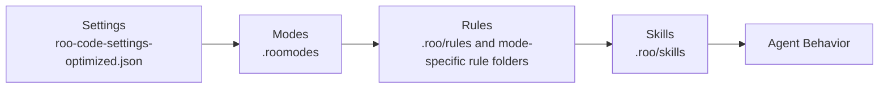

# Architecture

System view of how this template shapes Roo Code behavior after installation.

## 1. Layer model



### What each layer controls

| Layer | Primary responsibility | Source |
|---|---|---|
| Settings | Model routing, approvals, limits, command policy, context behavior | [`templates/roo-code-settings-optimized.json`](../templates/roo-code-settings-optimized.json) |
| Modes | Role definition, scope, tool groups, escalation paths | [`templates/.roomodes`](../templates/.roomodes) |
| Rules | Always-on operating constraints and workflows | [`templates/.roo/rules/`](../templates/.roo/) |
| Skills | Situational instructions triggered when a matching need is detected | [`templates/.roo/skills-registry.md`](../templates/.roo/skills-registry.md) |

## 2. Override precedence

Use this order when the same concept exists in multiple places:

1. **Workspace files** in `.roo/` and `.roomodes`
2. **Global files** in `~/.roo/`
3. **Roo Code defaults**

Practical result:

- A workspace rule or mode override wins over a global one.
- A missing workspace asset falls back to the global asset.
- If neither exists, Roo Code uses its built-in default behavior.

## 3. Skill triggering mechanism

This template is designed around a mandatory skill selection step documented by the installed skill guidance.

```text
Request arrives
→ check installed skills
→ compare request to skill descriptions / trigger conditions
→ load exactly one matching skill when applicable
→ continue with that skill's workflow
```

Key files involved:

- [`templates/.roo/rules/skill-awareness.md`](../templates/.roo/rules/skill-awareness.md) lists which skills are mandatory or optional.
- [`templates/.roo/skills-registry.md`](../templates/.roo/skills-registry.md) lists installed project skills, locations, and descriptions.
- The skill description is the matching surface; clearer descriptions trigger more reliably.

## 4. Mode routing and model selection

Model selection is controlled by `modeApiConfigs` in [`templates/roo-code-settings-optimized.json`](../templates/roo-code-settings-optimized.json).

| Mode | Routed config | Model |
|---|---|---|
| `architect` | `dx4cni8c3lp` | `claude-opus-4.6` |
| `code` | `dx4cni8c3lp` | `claude-opus-4.6` |
| `debug` | `dx4cni8c3lp` | `claude-opus-4.6` |
| `orchestrator` | `dx4cni8c3lp` | `claude-opus-4.6` |
| `ask` | `izbhd5y1o5` | `gpt-5.4` |
| `documentation-writer` | `izbhd5y1o5` | `gpt-5.4` |
| `coding-teacher` | `izbhd5y1o5` | `gpt-5.4` |
| `user-story-creator` | `izbhd5y1o5` | `gpt-5.4` |

Interpretation:

- Heavy reasoning modes route to Opus.
- Lighter explanation/documentation modes route to GPT-5.4.
- Changing one mapping changes the model used by that mode without editing the mode definition itself.

## 5. Command and context controls

Important runtime controls from [`templates/roo-code-settings-optimized.json`](../templates/roo-code-settings-optimized.json):

| Setting | Current optimized value | Effect |
|---|---|---|
| `allowedCommands` | `[*]` | Broad execution allowed unless blocked by deny list |
| `deniedCommands` | 29 blocked patterns | Prevents destructive or risky commands |
| `autoCondenseContext` | `true` | Shrinks context automatically |
| `autoCondenseContextPercent` | `70` | Starts condensing before the window is too full |
| `enableCheckpoints` | `true` | Enables restore points for long sessions |
| `maxOpenTabsContext` | `10` | Limits open-tab noise |
| `maxWorkspaceFiles` | `150` | Limits workspace file listing volume |

## 6. Installed file structure

```text
templates/
├── .roomodes                         # Workspace mode definitions copied by installer
├── .rooignore                        # Context filtering rules copied by installer
├── .roo/
│   ├── skills-registry.md            # Installed skill inventory
│   ├── rules/                        # 8 global rules
│   ├── rules-architect/              # Architect-only rules
│   ├── rules-code/                   # Code-only rules
│   ├── rules-debug/                  # Debug-only rules
│   ├── skills/                       # Project skills shipped by this template
│   └── learnings/                    # Captured patterns / long-term notes
├── roo-code-settings-optimized.json  # Import-ready settings profile
├── mode-template.json                # Reference for creating new modes
├── rule-template.md                  # Reference for creating new rules
├── rules/                            # Optional project-language rules
└── skill-template/                   # Starter template for a new skill
```

## 7. How the pieces work together

- The installer copies template assets into a workspace.
- Settings decide **which model** and **which permissions** each mode gets.
- Modes define **who the agent is** and **what tools it may use**.
- Rules define **guardrails and workflow**.
- Skills inject **task-specific playbooks** only when relevant.

Use [Getting Started](./getting-started.md) for setup, [Troubleshooting](./troubleshooting.md) when behavior is off, and [Quick Reference](./quick-reference.md) for daily lookup.
