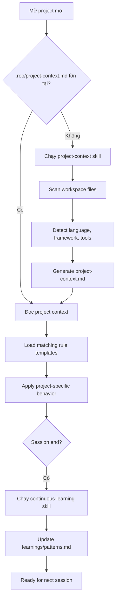
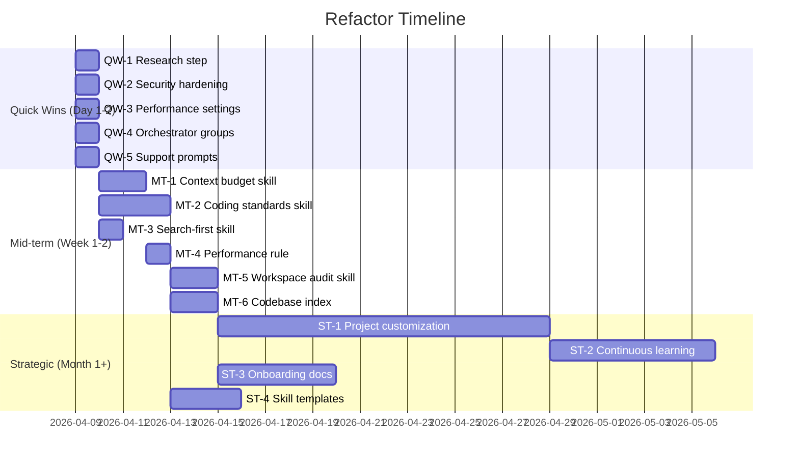

# Refactor Plan — Roo Code Settings Optimization

> Ngày tạo: 2026-04-08
> Mục tiêu: Đạt ≥8.5/10 trên hầu hết 11 tiêu chí trong evaluation scorecard
> Baseline: Trung bình hiện tại 6.5/10
> Benchmark: ECC + Awesome Skills
> Tài liệu liên quan: [`plans/evaluation-scorecard.md`](plans/evaluation-scorecard.md) | [`plans/benchmark-research.md`](plans/benchmark-research.md)

---

## Mục lục

1. [Quick Wins (1-2 ngày)](#phase-1-quick-wins-1-2-ngày)
2. [Cải tiến trung hạn (1-2 tuần)](#phase-2-cải-tiến-trung-hạn-1-2-tuần)
3. [Nâng cấp chiến lược (1+ tháng)](#phase-3-nâng-cấp-chiến-lược-1-tháng)
4. [System Config Analysis](#system-config-analysis)
5. [Mode Optimization](#mode-optimization)
6. [Skills Roadmap](#skills-roadmap)
7. [Project Customization Framework](#project-customization-framework)

---

## Phase 1: Quick Wins (1-2 ngày)

### QW-1. Thêm Phase 0 "Research & Reuse" vào development workflow

**Mục tiêu:** Enforce research trước khi implement — giảm code duplication, tăng accuracy.

**Lý do:** Scorecard #4 (Workflow: 7.0) và #7 (Accuracy: 7.5) đều bị kéo xuống vì thiếu step này. ECC có mandatory Research & Reuse step, là best practice đã được validate.

**Thay đổi cần làm:**
- Sửa `.roo/rules/development-workflow.md`:
  - Thêm "Phase 0: Research & Reuse" trước Phase 1
  - Nội dung: (1) Search existing codebase (`codebase_search`), (2) Check package registries, (3) Look for 80%+ match solutions, (4) Prefer proven approaches
  - Quality gate: Evidence of search performed (file paths checked, packages evaluated)
- Cập nhật bảng "When to Use Each Phase":
  - Medium/Large tasks: bắt buộc Phase 0
  - Trivial/Small: optional nhưng recommended

**File bị ảnh hưởng:**
- `.roo/rules/development-workflow.md` — thêm ~15 dòng

**Rủi ro:** Thấp. Chỉ thêm content vào existing rule. Agent có thể bỏ qua nếu instructions quá dài.
**Mitigation:** Giữ Phase 0 ngắn gọn (≤10 dòng), đặt ở ĐẦU file (avoid lost-in-middle).

**Cách kiểm tra:** Giao task "implement feature X" cho Code mode → verify agent thực hiện search trước khi viết code.

**Lợi ích kỳ vọng:** Workflow +1.0 (7.0→8.0), Accuracy +0.5 (7.5→8.0)

---

### QW-2. Tăng cường security cho command execution

**Mục tiêu:** Giảm attack surface từ `allowedCommands: ["*"]`.

**Lý do:** Scorecard #3 (Config: 7.5) bị trừ điểm vì `alwaysAllowExecute: true` + `allowedCommands: ["*"]` quá permissive. Agent có thể chạy `npm publish`, `git push -f`, `docker rm` mà user không biết.

**Thay đổi cần làm:**
- Sửa `roo-code-settings-optimized.json`:
  - Thêm vào `deniedCommands`: `"npm publish"`, `"git push -f"`, `"git push --force"`, `"docker rm"`, `"docker rmi"`, `"kubectl delete"`, `"pip install"` (ngoài venv), `"chmod 777"`, `"chown"`, `"mkfs"`, `"dd if="`, `"wget"`, `"curl.*|.*sh"` (pipe to shell)
  - **HOẶC** (approach tốt hơn): Đổi `allowedCommands` từ `["*"]` sang allowlist cho từng mode group:
    - Code mode: `["npm *", "npx *", "node *", "git *", "tsc *", "eslint *", "prettier *", "jest *", "vitest *"]`
    - Debug mode: same as Code + `"cat *", "type *", "findstr *"`
    - Architect/Ask: không cần command execution → bỏ `command` group

**File bị ảnh hưởng:**
- `roo-code-settings-optimized.json` — sửa `deniedCommands` array

**Rủi ro:** Trung bình. Deny list quá aggressive có thể block legitimate commands.
**Mitigation:** Bắt đầu với approach 1 (expand deny list), monitor 1 tuần, rồi migrate sang approach 2 (allowlist) nếu ổn.

**Cách kiểm tra:** Thử chạy các commands trong deny list → verify bị block.

**Lợi ích kỳ vọng:** Config quality +0.5 (7.5→8.0)

---

### QW-3. Tối ưu performance settings

**Mục tiêu:** Giảm token waste, tăng tốc agent response.

**Lý do:** Scorecard #2 (Opus: 6.0) và #3 (Config: 7.5) bị ảnh hưởng bởi settings chưa tối ưu.

**Thay đổi cần làm:**
- Sửa `roo-code-settings-optimized.json`:

| Setting | Hiện tại | Đề xuất | Lý do |
|---------|----------|---------|-------|
| `writeDelayMs` | 1000 | 500 | 1s quá chậm, 500ms đủ cho review |
| `maxDiagnosticMessages` | 50 | 20 | 50 messages quá nhiều, gây noise. 20 đủ cho most cases |
| `terminalShellIntegrationDisabled` | true | false | Bật lại để detect command completion. Nếu gây issue, revert |
| `checkpointTimeout` | 15 | 30 | 15s quá ngắn cho large files |
| `autoCondenseContextPercent` | 75 | 70 | Condense sớm hơn 1 chút, giữ buffer cho complex reasoning |
| `maxWorkspaceFiles` | 200 | 150 | Giảm files in context = ít noise hơn |
| `followupAutoApproveTimeoutMs` | 60000 | 30000 | 60s quá dài cho followup questions |

**File bị ảnh hưởng:**
- `roo-code-settings-optimized.json` — sửa 7 values

**Rủi ro:** Thấp. Tất cả đều có thể revert. `terminalShellIntegrationDisabled: false` có thể gây issue trên một số terminals.
**Mitigation:** Thay đổi từng setting một, test mỗi cái.

**Cách kiểm tra:** So sánh response time và token usage trước/sau thay đổi.

**Lợi ích kỳ vọng:** Config +0.5 (7.5→8.0), Opus +0.5 (6.0→6.5)

---

### QW-4. Giới hạn file access cho Orchestrator mode

**Mục tiêu:** Enforce "coordinate, don't implement" cho orchestrator.

**Lý do:** Scorecard #6 (Stability: 8.5) ghi nhận orchestrator có groups `["read", "edit", "command", "mcp"]` không giới hạn file — vi phạm nguyên tắc riêng.

**Thay đổi cần làm:**
- Sửa `.roomodes` — orchestrator entry:
  ```json
  "groups": [
    "read",
    ["edit", {"fileRegex": "\\.md$", "description": "Plans and documentation only"}],
    "command",
    "mcp"
  ]
  ```

**File bị ảnh hưởng:**
- `.roomodes` — sửa orchestrator groups

**Rủi ro:** Thấp. Orchestrator roleDefinition đã nói "DO NOT implement code", file restriction chỉ enforce thêm.

**Cách kiểm tra:** Orchestrator mode → thử edit `.ts` file → verify bị block.

**Lợi ích kỳ vọng:** Stability +0.5 (8.5→9.0)

---

### QW-5. Thêm `customSupportPrompts` cho enhance/plan

**Mục tiêu:** Tận dụng feature bị bỏ phí — custom prompt cho enhance và plan buttons.

**Lý do:** Scorecard #1 (Features: 8.0) ghi nhận `customSupportPrompts: {}` đang trống.

**Thay đổi cần làm:**
- Sửa `roo-code-settings-optimized.json`:
  ```json
  "customSupportPrompts": {
    "enhance": "Improve this prompt by: (1) making it specific and actionable, (2) adding expected output format, (3) identifying affected files, (4) adding success criteria. Keep the enhanced prompt concise.",
    "plan": "Create a step-by-step execution plan with: (1) phases in priority order, (2) affected files per step, (3) dependencies between steps, (4) verification method per step. Use checklist format."
  }
  ```

**File bị ảnh hưởng:**
- `roo-code-settings-optimized.json` — thêm 2 prompts

**Rủi ro:** Thấp. Chỉ thêm content, không ảnh hưởng existing behavior.

**Cách kiểm tra:** Nhập prompt đơn giản → click Enhance → verify prompt được cải thiện theo template.

**Lợi ích kỳ vọng:** Features +0.5 (8.0→8.5)

---

## Phase 2: Cải tiến trung hạn (1-2 tuần)

### MT-1. Tạo context-budget skill

**Mục tiêu:** Quản lý context window budget chủ động — giảm context overflow, tối ưu token usage.

**Lý do:** Scorecard #2 (Opus: 6.0) — gap lớn nhất là thiếu context budget management. ECC có `context-budget` skill và shortform guide warning: "200k context chỉ còn 70k với quá nhiều tools enabled".

**Thay đổi cần làm:**
- Tạo `.roo/skills/context-budget/SKILL.md`:
  ```
  ---
  name: context-budget
  description: Monitor and manage context window usage to prevent overflow and optimize token efficiency.
  ---
  ```
  - **When to Use:** Auto-trigger khi conversation > 20 tool calls hoặc > 50% estimated context usage
  - **Instructions:**
    1. Estimate current context usage (system prompt + rules + conversation + tool results)
    2. If > 60%: start being selective — chỉ read necessary files, summarize long outputs
    3. If > 70%: trigger context-checkpoint skill, consider condensing
    4. If > 80%: STOP expansive operations, summarize state, recommend new conversation
  - **MCP Tools Budget:** Recommend ≤80 active tools. If more → disable unused MCPs.
  - **File Reading Budget:** Prefer `mode: "indentation"` over full file reads. Use `limit` parameter.
  - **Output Budget:** Keep responses focused. Avoid repeating context already known.

- Cập nhật `.roo/rules/skill-awareness.md` — thêm `context-budget` vào table với ✅ Mandatory flag

**File bị ảnh hưởng:**
- `.roo/skills/context-budget/SKILL.md` — tạo mới (~50 dòng)
- `.roo/rules/skill-awareness.md` — thêm 1 row

**Rủi ro:** Trung bình. Skill quá aggressive có thể khiến agent "tiết kiệm" quá mức, bỏ qua context quan trọng.
**Mitigation:** Bắt đầu conservative (chỉ warn, không block), tune thresholds dần.

**Cách kiểm tra:** Conversation dài > 30 tool calls → verify agent tự checkpoint và manage context.

**Lợi ích kỳ vọng:** Opus +1.5 (6.0→7.5), Config +0.5 (8.0→8.5)

---

### MT-2. Tạo comprehensive coding-standards skill

**Mục tiêu:** Nâng cấp coding standards từ 41-dòng rule thành comprehensive skill với examples.

**Lý do:** Scorecard #4 (Workflow: 7.0) — coding standards hiện tại ngắn, chỉ cover TypeScript, thiếu examples. ECC có skill 550 dòng.

**Thay đổi cần làm:**
- Tạo `.roo/skills/coding-standards/SKILL.md` (~150-200 dòng):
  - **Naming Conventions** — camelCase/PascalCase/UPPER_SNAKE rules + examples
  - **Error Handling Patterns** — PASS/FAIL examples cho try/catch, Result types, error boundaries
  - **Async Patterns** — Promise handling, async/await best practices, race condition prevention
  - **Immutability Patterns** — spread operators, map/filter/reduce vs mutation
  - **API Response Patterns** — standard response shapes, error formats
  - **File Organization** — module boundaries, index files, barrel exports
  - **Testing Patterns** — AAA, naming conventions, mock boundaries
  - **Anti-patterns Section** — common mistakes with FAIL examples

- Giữ `.roo/rules-code/coding-standards.md` ngắn gọn (hiện tại) — nó reference tới skill:
  ```markdown
  Detailed standards with examples: see `coding-standards` skill (auto-loaded).
  ```

**File bị ảnh hưởng:**
- `.roo/skills/coding-standards/SKILL.md` — tạo mới (~180 dòng)
- `.roo/rules-code/coding-standards.md` — thêm 1 dòng reference
- `.roo/rules/skill-awareness.md` — thêm 1 row

**Rủi ro:** Trung bình. Skill quá dài sẽ consume context window. 
**Mitigation:** Dùng progressive disclosure: SKILL.md chỉ chứa overview + rules, chi tiết examples trong `references/` subfolder.

**Cách kiểm tra:** Giao task code → verify agent follow coding standards chi tiết hơn, sử dụng PASS/FAIL patterns.

**Lợi ích kỳ vọng:** Workflow +1.0 (8.0→9.0), Accuracy +0.5 (8.0→8.5)

---

### MT-3. Tạo search-first skill

**Mục tiêu:** Enforce "đọc trước, viết sau" — mandatory search step trước mọi implementation.

**Lý do:** Scorecard #7 (Accuracy: 7.5) — thiếu enforcement cho codebase search trước khi implement.

**Thay đổi cần làm:**
- Tạo `.roo/skills/search-first/SKILL.md`:
  ```
  ---
  name: search-first
  description: Enforce research-before-implementation workflow to reduce duplication and hallucination.
  ---
  ```
  - **When to Use:** Before creating ANY new file or function in Code mode
  - **Instructions:**
    1. `codebase_search` with semantic query related to the task
    2. `search_files` with regex for similar patterns
    3. Check `package.json` / imports for existing utilities
    4. Document findings: "Found similar: [file:line] — will extend/reuse" OR "No existing match found"
    5. If ≥80% match exists → adapt, don't recreate
  - **Mandatory Output:** "Search Evidence: [what was searched] → [what was found]"

- Cập nhật `.roo/rules/skill-awareness.md` — thêm row, mark as ✅ Mandatory for Code mode

**File bị ảnh hưởng:**
- `.roo/skills/search-first/SKILL.md` — tạo mới (~40 dòng)
- `.roo/rules/skill-awareness.md` — thêm 1 row

**Rủi ro:** Thấp. Chỉ thêm search step, không thay đổi logic.
**Mitigation:** Chỉ mandatory cho Code mode khi tạo file/function mới.

**Cách kiểm tra:** Giao task "create utility function" → verify agent search codebase trước.

**Lợi ích kỳ vọng:** Accuracy +1.0 (8.0→9.0)

---

### MT-4. Tạo performance-optimization rule

**Mục tiêu:** Guidance cho agent về token optimization, model routing, context management.

**Lý do:** Scorecard #2 (Opus: 6.0) — không có performance guidance cho agent.

**Thay đổi cần làm:**
- Tạo `.roo/rules/performance-optimization.md`:
  - **Token Optimization:**
    - Prefer `read_file` with `mode: "indentation"` over full file reads
    - Use `limit` parameter — đọc tối đa 200 dòng/lần cho exploration, full chỉ khi cần
    - Prefer `codebase_search` over `search_files` cho semantic queries
    - Khi output dài: summarize key points, don't repeat full context
  - **Context Management:**
    - Track estimated context usage mentally
    - After 20+ tool calls: consider if context-checkpoint needed
    - Place critical info at START or END of responses (lost-in-middle prevention)
    - When condensing: preserve decisions, drop verbose explanations
  - **Response Efficiency:**
    - Answer scope: minimum necessary to complete the task
    - Avoid defensive verbosity — be precise, not wordy
    - Code blocks: show only changed sections + context, not entire files (trừ khi dùng write_to_file)

**File bị ảnh hưởng:**
- `.roo/rules/performance-optimization.md` — tạo mới (~40 dòng)

**Rủi ro:** Thấp. Rule guidance, không ảnh hưởng functionality.

**Cách kiểm tra:** Monitor token usage trước/sau thêm rule.

**Lợi ích kỳ vọng:** Opus +1.0 (7.5→8.5)

---

### MT-5. Tạo workspace-audit skill

**Mục tiêu:** Self-audit capability — agent tự kiểm tra configuration consistency.

**Lý do:** Scorecard #11 (Sustainability: 6.5) — không có self-audit mechanism.

**Thay đổi cần làm:**
- Tạo `.roo/skills/workspace-audit/SKILL.md`:
  - **When to Use:** Khi user request "audit workspace" hoặc sau khi thêm/sửa modes/rules/skills
  - **Instructions:**
    1. List all modes → verify mỗi mode có roleDefinition, whenToUse, groups
    2. List all rules → verify không conflict (ví dụ: rule A nói "always X", rule B nói "never X")
    3. List all skills → verify mỗi skill có YAML frontmatter, description matches behavior
    4. Check `.roomodes` vs global modes → identify overrides, verify consistency
    5. Check `skill-awareness.md` → verify tất cả skills đều listed
    6. Check `modeApiConfigs` → verify model routing hợp lý
    7. Output: Audit Report with PASS/WARN/FAIL per check

**File bị ảnh hưởng:**
- `.roo/skills/workspace-audit/SKILL.md` — tạo mới (~60 dòng)
- `.roo/rules/skill-awareness.md` — thêm 1 row

**Rủi ro:** Thấp. Read-only audit, không thay đổi gì.

**Cách kiểm tra:** Chạy "audit workspace" → verify report đầy đủ và accurate.

**Lợi ích kỳ vọng:** Sustainability +1.0 (6.5→7.5)

---

### MT-6. Bật codebase index

**Mục tiêu:** Enable semantic search capability cho agent.

**Lý do:** Scorecard #1 (Features: 8.0) — `codebaseIndexEnabled: false` = mất semantic search.

**Thay đổi cần làm:**
- Sửa `roo-code-settings-optimized.json`:
  - `codebaseIndexEnabled: true`
  - Chọn embedder phù hợp: nếu có OpenAI API key → dùng `text-embedding-3-small`; nếu local → dùng Ollama `nomic-embed-code`
  - Setup Qdrant instance (local Docker hoặc cloud)
  - `codebaseIndexSearchMinScore: 0.4` → giữ nguyên (hợp lý)
  - `codebaseIndexSearchMaxResults: 50` → giảm xuống `20` (đủ cho most queries)

**File bị ảnh hưởng:**
- `roo-code-settings-optimized.json` — sửa codebase index config section

**Rủi ro:** Trung bình. Cần infrastructure (Qdrant), tốn thêm resources. Embedding quality phụ thuộc vào model choice.
**Mitigation:** Bắt đầu với local Qdrant Docker + free embedding model. Test trước khi rely on it.

**Cách kiểm tra:** Search query phức tạp → verify results relevant hơn regex search.

**Lợi ích kỳ vọng:** Features +0.5 (8.5→9.0), Accuracy +0.5 (9.0→9.5)

---

## Phase 3: Nâng cấp chiến lược (1+ tháng)

### ST-1. Tạo Project Customization Framework

**Mục tiêu:** Giải quyết gap lớn nhất — agent tự điều chỉnh hành vi theo dự án.

**Lý do:** Scorecard #9 (Project fit: 5.0) — gap lớn nhất, ảnh hưởng Critical.

**Thay đổi cần làm:**

#### A. Tạo `.roo/skills/project-context/SKILL.md` — Project Context Detection Skill
- **When to Use:** Auto-trigger khi mở project mới hoặc user request
- **Instructions:**
  1. Scan workspace: `package.json`, `pyproject.toml`, `go.mod`, `Cargo.toml`, `build.gradle`, `pom.xml`
  2. Detect: language, framework, package manager, test framework, linter, formatter
  3. Scan `.roo/` directory: modes, rules, skills đang active
  4. Generate `.roo/project-context.md`:
    ```markdown
    # Project Context (auto-generated)
    - Language: TypeScript
    - Framework: Next.js 14
    - Package Manager: pnpm
    - Test Framework: Vitest
    - Linter: ESLint + Prettier
    - Architecture: Monorepo (packages/frontend, packages/backend)
    - Key Directories: src/components, src/lib, src/api
    ```
  5. Agent đọc file này mỗi session để biết context

#### B. Tạo project-type rule templates
- `templates/rules/typescript-project.md` — TS-specific coding standards
- `templates/rules/python-project.md` — Python-specific standards
- `templates/rules/monorepo-project.md` — Monorepo conventions
- User copy template phù hợp vào `.roo/rules/` khi setup project

#### C. Bật `enableSubfolderRules: true`
- Cho phép `.roo/rules/` trong subdirectories cho monorepo
- Ví dụ: `packages/frontend/.roo/rules/react-patterns.md`

#### D. Tạo project-type skill bundles
- `.roo/skills-bundles/typescript-web/` — coding standards + testing patterns + component patterns
- `.roo/skills-bundles/node-api/` — API patterns + error handling + logging
- User activate bundle phù hợp

**File bị ảnh hưởng:**
- `.roo/skills/project-context/SKILL.md` — tạo mới
- `templates/rules/typescript-project.md` — tạo mới
- `templates/rules/python-project.md` — tạo mới
- `roo-code-settings-optimized.json` — `enableSubfolderRules: true`
- Documentation files

**Rủi ro:** Cao. Framework phức tạp, cần iterate nhiều lần. Auto-detection có thể sai.
**Mitigation:** MVP chỉ gồm phần A (project-context skill) + 1 template. Iterate dần.

**Cách kiểm tra:** Mở 3 project khác nhau (TS web, Python API, Go service) → verify agent nhận diện đúng và điều chỉnh behavior.

**Lợi ích kỳ vọng:** Project fit +3.0 (5.0→8.0)

---

### ST-2. Tạo Continuous Learning System

**Mục tiêu:** Agent rút kinh nghiệm từ sessions trước — improve over time.

**Lý do:** Scorecard #11 (Sustainability: 6.5) — thiếu learning loop.

**Thay đổi cần làm:**
- Tạo `.roo/skills/continuous-learning/SKILL.md`:
  - **When to Use:** Cuối mỗi complex session (>50 tool calls) hoặc khi user request
  - **Instructions:**
    1. Review session: task, approach, outcome, issues encountered
    2. Extract patterns:
       - "This approach worked well for [problem type]"
       - "Mistake: [what went wrong], Root cause: [why], Prevention: [how]"
       - "User preference: [observed behavior]"
    3. Append to `.roo/learnings/patterns.md`:
       ```markdown
       ## Session {date} — {task summary}
       ### Worked Well
       - ...
       ### Mistakes & Lessons
       - ...
       ### User Preferences
       - ...
       ```
    4. Agent đọc `patterns.md` ở đầu mỗi session (thêm vào custom instructions)

- Tạo `.roo/learnings/` directory structure
- Cập nhật mode definitions để reference learnings file

**File bị ảnh hưởng:**
- `.roo/skills/continuous-learning/SKILL.md` — tạo mới
- `.roo/learnings/patterns.md` — tạo mới (ban đầu trống)
- `.roomodes` — thêm reference trong customInstructions

**Rủi ro:** Trung bình. Learnings file có thể grow uncontrolled, gây context noise. Agent có thể extract wrong patterns.
**Mitigation:** Cap file size (≤100 dòng), review periodically, user curate.

**Cách kiểm tra:** 5 sessions liên tiếp → verify patterns.md có meaningful entries → verify agent áp dụng learnings.

**Lợi ích kỳ vọng:** Sustainability +1.5 (7.5→9.0)

---

### ST-3. Tạo Onboarding Documentation Suite

**Mục tiêu:** Giảm learning curve từ "vài giờ" xuống "30 phút".

**Lý do:** Scorecard #10 (Onboarding: 4.0) — điểm thấp nhất.

**Thay đổi cần làm:**
- Tạo `docs/getting-started.md` — Quick start guide (15 phút đọc):
  1. Prerequisites
  2. Installation (`npm install` + `node bin/install.js`)
  3. Modes overview — khi nào dùng mode nào (bảng tóm tắt)
  4. Basic workflow — typical task flow
  5. Customization primer — how to add rules, skills, modes

- Tạo `docs/architecture.md` — System architecture:
  1. Layer diagram: Settings → Modes → Rules → Skills → Agent Behavior
  2. Override precedence: workspace > global > default
  3. Skill triggering mechanism
  4. Context flow diagram (Mermaid)

- Tạo `docs/troubleshooting.md` — Common issues:
  1. "Agent ignoring my rules" → check rule file location, mode-specific vs global
  2. "Context overflow" → context-budget skill, reduce maxWorkspaceFiles
  3. "Mode not switching" → check modeApiConfigs, mode slug matching
  4. "Skill not triggering" → check mandatory_skill_check, description matching
  5. "Command blocked" → check deniedCommands list

- Tạo `docs/quick-reference.md` — Cheat sheet:
  - Mode → Purpose → Trigger keywords
  - Skill → When → Mandatory?
  - Setting → Impact → Default vs Current

- Cập nhật `README.md` — reference tới docs/

**File bị ảnh hưởng:**
- `docs/getting-started.md` — tạo mới
- `docs/architecture.md` — tạo mới
- `docs/troubleshooting.md` — tạo mới
- `docs/quick-reference.md` — tạo mới
- `README.md` — cập nhật

**Rủi ro:** Thấp. Documentation only.

**Cách kiểm tra:** Người mới đọc getting-started.md → có thể setup và sử dụng hệ thống trong 30 phút.

**Lợi ích kỳ vọng:** Onboarding +4.0 (4.0→8.0)

---

### ST-4. Tạo Skill Templates & Registry

**Mục tiêu:** Chuẩn hóa skill creation, enable skill ecosystem growth.

**Lý do:** Scorecard #5 (Extensibility: 6.5) và #8 (Reuse: 5.5) — thiếu templates và registry.

**Thay đổi cần làm:**
- Tạo `templates/skill-template/SKILL.md`:
  ```markdown
  ---
  name: {skill-name}
  description: {Brief description under 200 chars}
  risk: safe
  source: self
  tags: []
  ---
  # {Skill Name}
  ## When to Use
  ## Instructions
  ## Important
  ```

- Tạo `templates/mode-template.json`:
  ```json
  {
    "slug": "",
    "name": "",
    "roleDefinition": "",
    "whenToUse": "",
    "customInstructions": "",
    "groups": ["read"]
  }
  ```

- Tạo `templates/rule-template.md`:
  ```markdown
  # {Rule Name} — {Scope}
  ## Rules
  ## Hard Rules
  ```

- Cập nhật skill-writer mode instructions để reference templates
- Tạo `.roo/skills-registry.md` — index tất cả skills:
  ```markdown
  # Skills Registry
  | Name | Location | Mandatory | Risk | Description |
  |------|----------|-----------|------|-------------|
  | context-checkpoint | .roo/skills/ | No | safe | Save progress... |
  | lint-and-validate | ~/.roo/skills/ | Yes | safe | Validate after... |
  ```

**File bị ảnh hưởng:**
- `templates/skill-template/SKILL.md` — tạo mới
- `templates/mode-template.json` — tạo mới
- `templates/rule-template.md` — tạo mới
- `.roo/skills-registry.md` — tạo mới

**Rủi ro:** Thấp. Templates và documentation.

**Cách kiểm tra:** Tạo skill mới dùng template → verify nhanh hơn và consistent hơn.

**Lợi ích kỳ vọng:** Extensibility +1.5 (6.5→8.0), Reuse +2.0 (5.5→7.5)

---

## System Config Analysis

Phân tích chi tiết từng setting trong [`roo-code-settings-optimized.json`](roo-code-settings-optimized.json).

### Provider Profiles — Đang hợp lý ✅

| Setting | Value | Đánh giá |
|---------|-------|----------|
| `currentApiConfigName` | "Opus 4.6" | ✅ Hợp lý — dùng model mạnh nhất làm default |
| `rateLimitSeconds` | 0 | ✅ Không cần rate limit cho endpoint riêng |
| `consecutiveMistakeLimit` | 3 | ✅ Tốt — stop sau 3 lỗi liên tiếp |
| `enableReasoningEffort` | true | ✅ Enable reasoning control |

### Model Configs — Cần điều chỉnh ⚠️

| Setting | Value | Đánh giá |
|---------|-------|----------|
| `maxTokens: 32000` (Opus) | 32k | ⚠️ Có thể thấp cho complex architecture docs. Xem xét 64k cho architect mode |
| `contextWindow: 244000` (Opus) | 244k | ✅ Chính xác cho Opus 4.6 |
| `contextWindow: 350000` (GPT-5.4) | 350k | ✅ Nếu endpoint hỗ trợ |
| `reasoningEffort: "high"` (Opus) | high | ✅ Hợp lý cho heavy tasks |
| `reasoningEffort: "medium"` (GPT-5.4) | medium | ✅ Tiết kiệm cho light tasks |
| `supportsPromptCache: false` | false | ⚠️ Nếu endpoint hỗ trợ, nên bật. Tiết kiệm 90% cost cho system prompts |
| `inputPrice: 0` / `outputPrice: 0` | 0 | ⚠️ Nếu endpoint tính phí, cần set đúng để cost tracking hoạt động |

### Mode API Configs — Cần review ⚠️

| Mode | Model | Đánh giá |
|------|-------|----------|
| architect | Opus | ✅ Cần reasoning mạnh cho architecture |
| code | Opus | ✅ Cần reasoning cho complex code |
| ask | GPT-5.4 | ⚠️ Hơi yếu. Nhiều câu hỏi complex cần Opus. Xem xét: ask dùng Opus nhưng `reasoningEffort: medium` |
| debug | Opus | ✅ Cần reasoning cho root cause analysis |
| orchestrator | Opus | ✅ Cần reasoning cho decomposition |
| documentation-writer | GPT-5.4 | ✅ Docs writing không cần heavy reasoning |
| coding-teacher | GPT-5.4 | ⚠️ Teaching có thể cần reasoning sâu hơn. Tuy nhiên, acceptable |
| security-review | Opus | ✅ Security analysis cần reasoning mạnh |

### Global Settings — Phân tích chi tiết

#### Đang hợp lý ✅ (giữ nguyên)

| Setting | Value | Lý do giữ |
|---------|-------|-----------|
| `autoApprovalEnabled` | true | Cần cho smooth workflow |
| `alwaysAllowReadOnly` | true | Agent cần đọc files |
| `alwaysAllowReadOnlyOutsideWorkspace` | false | Security — không đọc ngoài workspace |
| `alwaysAllowWrite` | true | Code mode cần ghi files |
| `alwaysAllowWriteOutsideWorkspace` | false | Security |
| `alwaysAllowWriteProtected` | false | Security |
| `alwaysAllowMcp` | true | MCP tools cần thiết |
| `alwaysAllowModeSwitch` | true | Smooth mode transitions |
| `alwaysAllowSubtasks` | true | Orchestrator cần delegate |
| `autoCondenseContext` | true | Critical cho long conversations |
| `includeCurrentTime` | true | Useful context |
| `includeCurrentCost` | true | Cost awareness |
| `enableCheckpoints` | true | Backup mechanism |
| `mcpEnabled` | true | MCP tools cần thiết |
| `showRooIgnoredFiles` | false | Giữ clean |
| `language` | "vi" | User preference |
| `experiments.preventFocusDisruption` | true | UX improvement |
| `experiments.runSlashCommand` | true | Enable slash commands |
| `enterBehavior` | "send" | User preference |

#### Đang kìm hãm ⚠️ (cần thay đổi)

| Setting | Hiện tại | Vấn đề | Đề xuất |
|---------|----------|--------|---------|
| `allowedCommands` | `["*"]` | Quá permissive | Expand deny list hoặc switch to allowlist |
| `writeDelayMs` | 1000 | Chậm batch operations | Giảm xuống 500 |
| `maxDiagnosticMessages` | 50 | Token noise | Giảm xuống 20 |
| `terminalShellIntegrationDisabled` | true | Mất command completion detection | Bật (false) |
| `checkpointTimeout` | 15 | Quá ngắn | Tăng lên 30 |
| `maxWorkspaceFiles` | 200 | Có thể quá nhiều cho large repos | Giảm xuống 150 |
| `followupAutoApproveTimeoutMs` | 60000 | Quá dài | Giảm xuống 30000 |
| `codebaseIndexEnabled` | false | Mất semantic search | Bật khi có infrastructure |
| `enableSubfolderRules` | false | Không customize per-directory | Bật khi dùng monorepo |
| `customSupportPrompts` | `{}` | Bỏ phí feature | Thêm enhance + plan prompts |
| `allowedMaxRequests` | null | Không giới hạn | Set limit hợp lý (ví dụ: 200) |
| `allowedMaxCost` | null | Không giới hạn | Set limit nếu endpoint tính phí |

#### Cần thay đổi ngay 🔴

| Setting | Hiện tại | Đề xuất | Phase |
|---------|----------|---------|-------|
| `deniedCommands` | 17 items | Thêm 10+ items nữa | QW-2 |
| `writeDelayMs` | 1000 | 500 | QW-3 |
| `maxDiagnosticMessages` | 50 | 20 | QW-3 |
| `customSupportPrompts` | `{}` | Thêm enhance + plan | QW-5 |

---

## Mode Optimization

### Modes cần enhance

| Mode | Vấn đề | Đề xuất |
|------|--------|---------|
| **Orchestrator** | Groups `["read", "edit", "command", "mcp"]` quá rộng — vi phạm "coordinate, don't implement" | Giới hạn edit chỉ `.md` files (QW-4) |
| **Ask** | Dùng GPT-5.4 medium reasoning — có thể weak cho complex questions | Xem xét Opus với `reasoningEffort: medium` |
| **Code** | Thiếu reference tới coding-standards skill | Thêm reference trong customInstructions sau khi tạo skill (MT-2) |
| **Merge Resolver** | Groups `["read", "edit", "command", "mcp"]` không giới hạn file | Xem xét giới hạn edit pattern |

### Modes thừa/ít giá trị — đề xuất xử lý

| Mode | Vấn đề | Đề xuất |
|------|--------|---------|
| **Google GenAI Developer** | Quá specific — chỉ cho 1 API | Giữ nhưng di chuyển ra "optional modes" nếu có tier system |
| **Coding Teacher** | Ít dùng trong production workflow | Giữ — có giá trị learning |
| **User Story Creator** | Overlap với Architect mode planning | Giữ — specialized use case |

### Mode tier system (đề xuất chiến lược)

```
Core Modes (luôn active):
├── 🏗️ Architect
├── 💻 Code  
├── 🪲 Debug
├── 🪃 Orchestrator
├── ❓ Ask
├── 🧪 Testing
└── 🔍 Code Review

Extended Modes (active khi cần):
├── 🛡️ Security Reviewer
├── ✍️ Documentation Writer
├── 🧩 Skill Writer
├── ✍️ Mode Writer
└── 🔀 Merge Resolver

Optional Modes (chỉ khi project-specific):
├── 🤖 Google GenAI Developer
├── 💡 Coding Teacher
├── 📝 User Story Creator
├── 🔍 Project Research
├── 🧪 Jest Test Engineer
└── 🚀 DevOps
```

**Lưu ý:** Roo Code hiện tại KHÔNG hỗ trợ mode tiers. Đây là suggestion cho custom implementation hoặc future feature request. Workaround: documentation trong `docs/quick-reference.md` chỉ rõ mode nào dùng khi nào.

---

## Skills Roadmap

### Thứ tự ưu tiên tạo skills mới

| # | Skill | Phase | Mandatory? | Tiêu chí cải thiện | Effort |
|---|-------|-------|------------|-------------------|--------|
| 1 | `context-budget` | MT-1 | ✅ Yes | #2 Opus, #3 Config | Medium |
| 2 | `coding-standards` | MT-2 | ✅ Yes (Code mode) | #4 Workflow, #7 Accuracy | Medium |
| 3 | `search-first` | MT-3 | ✅ Yes (Code mode) | #7 Accuracy | Small |
| 4 | `workspace-audit` | MT-5 | No | #11 Sustainability | Small |
| 5 | `project-context` | ST-1 | No (auto-trigger) | #9 Project fit | Large |
| 6 | `continuous-learning` | ST-2 | No | #11 Sustainability | Medium |

### Skills ecosystem vision

```
.roo/skills/
├── context-budget/        ← MT-1: Context window management
│   └── SKILL.md
├── context-checkpoint/    ← Existing: Save progress
│   └── SKILL.md
├── coding-standards/      ← MT-2: Comprehensive coding standards
│   ├── SKILL.md
│   └── references/
│       ├── typescript-patterns.md
│       ├── error-handling.md
│       └── anti-patterns.md
├── search-first/          ← MT-3: Research before implementation
│   └── SKILL.md
├── workspace-audit/       ← MT-5: Self-audit configuration
│   └── SKILL.md
├── project-context/       ← ST-1: Auto-detect project type
│   ├── SKILL.md
│   └── templates/
│       ├── typescript-project.md
│       └── python-project.md
└── continuous-learning/   ← ST-2: Learn from sessions
    └── SKILL.md
```

---

## Project Customization Framework

### Tầm nhìn: 3-Layer Customization

```
Layer 1: Global (áp dụng mọi project)
├── ~/.roo/skills/ — Global skills (lint-and-validate, systematic-debugging, etc.)
├── ~/.roo/rules/ — Global rules (không tồn tại — dùng system rules thay vào)
└── VS Code globalSettings — Custom modes, provider profiles

Layer 2: Project (override per project)
├── .roo/skills/ — Project-specific skills
├── .roo/rules/ — Project-specific global rules
├── .roo/rules-{mode}/ — Project-specific mode rules
├── .roomodes — Workspace mode overrides
├── .rooignore — File exclusions
└── .roo/project-context.md — Auto-generated project context (NEW)

Layer 3: User-Tunable (runtime adjustments)
├── .roo/learnings/patterns.md — Accumulated learnings (NEW)
├── roo-code-settings-optimized.json — Settings (already tunable)
└── Mode-specific API configs — Model selection per mode
```

### Phương pháp "hành vi tự điều chỉnh theo dự án"



**Key insight:** Hệ thống không cần biết MỌI project type — chỉ cần biết ĐỦ để điều chỉnh behavior. Project context file là bridge giữa "generic agent" và "project-aware agent".

---

## Projected Scores After Refactor

| # | Tiêu chí | Hiện tại | Sau QW | Sau MT | Sau ST | Target |
|---|----------|----------|--------|--------|--------|--------|
| 1 | Features | 8.0 | 8.5 | 9.0 | 9.0 | ≥8.5 ✅ |
| 2 | Opus utilization | 6.0 | 6.5 | 8.5 | 9.0 | ≥8.5 ✅ |
| 3 | Config quality | 7.5 | 8.5 | 9.0 | 9.0 | ≥8.5 ✅ |
| 4 | Workflow | 7.0 | 8.0 | 9.0 | 9.0 | ≥8.5 ✅ |
| 5 | Extensibility | 6.5 | 6.5 | 7.5 | 8.5 | ≥8.5 ✅ |
| 6 | Stability | 8.5 | 9.0 | 9.0 | 9.0 | ≥8.5 ✅ |
| 7 | Accuracy | 7.5 | 8.0 | 9.0 | 9.5 | ≥8.5 ✅ |
| 8 | Reuse | 5.5 | 5.5 | 6.5 | 8.0 | ≥8.0 ⚠️ |
| 9 | Project fit | 5.0 | 5.0 | 5.5 | 8.0 | ≥8.0 ⚠️ |
| 10 | Onboarding | 4.0 | 4.0 | 4.5 | 8.0 | ≥8.0 ⚠️ |
| 11 | Sustainability | 6.5 | 6.5 | 7.5 | 9.0 | ≥8.5 ✅ |
| | **TRUNG BÌNH** | **6.5** | **7.1** | **7.7** | **8.7** | **≥8.5** |

**Ghi chú:** 
- Tiêu chí #8, #9, #10 khó đạt 8.5 vì phụ thuộc vào documentation và framework phức tạp
- QW phase cải thiện ngay 0.6 điểm trung bình — ROI cao nhất
- MT phase cải thiện thêm 0.6 — focused on skills
- ST phase cải thiện thêm 1.0 — strategic investments

---

## Execution Order & Dependencies



### Dependencies
- MT-2 (coding-standards skill) depends on QW-1 (research step) — need research-first mindset before writing standards
- MT-4 (performance rule) depends on MT-1 (context-budget skill) — rule references skill
- MT-5 (workspace audit) depends on MT-2 — audit checks coding standards compliance
- ST-1 (project customization) depends on MT-5 — audit capability needed for framework
- ST-2 (continuous learning) depends on ST-1 — learning needs project context

---

## Sai lầm tư duy cần sửa — Nói thẳng

### 1. "Deny list đủ cho security" — SAI
**Hiện trạng:** `allowedCommands: ["*"]` + 17 denied commands = "cho phép tất cả trừ những gì cấm rõ".
**Vấn đề:** Không thể liệt kê HẾT dangerous commands. `npm publish`, `git push -f`, `docker rm`, `kubectl delete` đều không trong deny list.
**Hướng thay thế:** Chuyển sang allowlist model — chỉ cho phép commands đã biết an toàn. Bắt đầu bằng expanding deny list (QW-2), migrate dần sang allowlist.

### 2. "18 modes là đủ tốt" — CẦN XEM LẠI
**Hiện trạng:** 5 workspace modes + 13 global modes = 18 modes. Nhiều mode hiếm khi dùng (Google GenAI, Coding Teacher, User Story Creator).
**Vấn đề:** Orchestrator phải "biết" 18 modes để delegate. Quá nhiều choices = decision fatigue, potential misrouting.
**Hướng thay thế:** Implement "core vs optional" tier trong documentation. Orchestrator ưu tiên core modes. Optional modes chỉ khi user explicitly request.

### 3. "Skills sẽ phát triển tự nhiên" — KHÔNG
**Hiện trạng:** 1 project skill sau nhiều tháng. Global skills đều là community/third-party.
**Vấn đề:** Skills ecosystem stagnant. Không có incentive hay mechanism để grow.
**Hướng thay thế:** Proactive roadmap (xem Skills Roadmap ở trên). Tạo templates + documentation + registry để lower barrier to creation.

### 4. "One config fits all" — GAP LỚN NHẤT
**Hiện trạng:** Cùng 1 bộ rules/modes/skills cho mọi project.
**Vấn đề:** TypeScript web app ≠ Python ML project ≠ Go microservice. Agent xử lý giống nhau cho tất cả.
**Hướng thay thế:** Project Customization Framework (ST-1). Bắt đầu nhỏ: project-context skill auto-detect → generate `.roo/project-context.md`.

### 5. "Context window lớn = không cần quản lý" — SAI
**Hiện trạng:** 244k context window, `autoCondenseContextPercent: 75`, nhưng không có proactive management.
**Vấn đề:** Agent tiêu thụ context mà không tracking. Khi đạt 75% → condense mất information. Lost-in-middle xảy ra ở 50%.
**Hướng thay thế:** Context budget skill (MT-1) + performance rule (MT-4) = proactive management, không đợi đến 75%.
