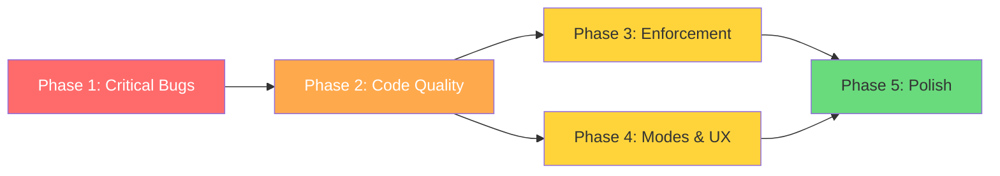

# Upgrade Plan v2 — roo_code_setting

> **Date**: 2026-04-09
> **Baseline scores**: Code Quality 7.6/10 · Effectiveness 8.1/10
> **Target scores**: Code Quality 9.0+ · Effectiveness 9.2+
> **Total effort estimate**: ~16–22 hours across 5 phases

---

## 1. Executive Summary

Hai rounds review (Code Quality 21 tiêu chí, Effectiveness 26 tiêu chí) phát hiện **20 điểm yếu** từ critical bugs đến nice-to-have. Kế hoạch này chia 20 items thành **5 phases**, mỗi phase independently deliverable, ordered by risk (fail fast). Phase 1 fix 2 critical bugs gây broken functionality cho user. Phase 2 nâng code quality của chính package. Phase 3–4 cải thiện effectiveness. Phase 5 là community-ready polish.

---

## 2. Priority Matrix

| Priority | # | Weakness | Impact | Files Affected |
|----------|---|----------|--------|----------------|
| 🔴 P0 | 1 | MCP `${VAR}` syntax — RooCode không expand env vars | Users nhận literal string, MCP broken | [`templates/mcp.json`](templates/mcp.json) |
| 🔴 P0 | 2 | Env var mismatch — installer nói `GITHUB_TOKEN` nhưng mcp.json dùng `GITHUB_PERSONAL_ACCESS_TOKEN` | Confusion, env var set sai tên | [`bin/install.js:288`](bin/install.js:288), [`templates/mcp.json:7`](templates/mcp.json:7) |
| 🟠 P1 | 3 | Không có unit tests | Vi phạm own TDD principles | `package.json`, new `tests/` dir |
| 🟠 P1 | 4 | Version chưa bump, không CHANGELOG | Không track changes, npm confusion | [`package.json:3`](package.json:3), new `CHANGELOG.md` |
| 🟠 P1 | 5 | package.json thiếu engines, test script, devDependencies | Missing metadata, CI không biết Node version | [`package.json`](package.json) |
| 🟠 P1 | 6 | Installer thiếu try-catch | EACCES/permission errors crash ungracefully | [`bin/install.js`](bin/install.js) (Phase 1 file ops) |
| 🟠 P1 | 7 | Installer thiếu `--clean` flag | Orphan skills từ old installs không bị dọn | [`bin/install.js`](bin/install.js) |
| 🟠 P1 | 8 | README tree sai — ghi "8 global rules" nhưng có 9 files | Documentation inaccuracy | [`README.md:25`](README.md:25) |
| 🟡 P2 | 9 | Enforcement gap — rules là text, agent có thể skip | Rules effectiveness giảm | All rule `.md` files |
| 🟡 P2 | 10 | Self-improvement loop yếu — learnings không auto-read | `continuous-learning` skill output bị ignored | [`templates/.roo/skills/continuous-learning/`](templates/.roo/skills/continuous-learning/) |
| 🟡 P2 | 11 | Mode-specific rules thiếu — chỉ 3/18 modes có rules riêng | 15 modes chạy generic rules only | New `rules-*` directories |
| 🟡 P2 | 12 | roleDefinitions ngắn (~100 words) | Specialist behavior không đủ sâu | [`templates/roo-code-settings-optimized.json`](templates/roo-code-settings-optimized.json) |
| 🟡 P2 | 13 | Claude Code tool names trong global skills | Có thể confuse RooCode agent | `templates/global-skills/` SKILL.md files |
| 🟡 P2 | 14 | Thiếu `--dry-run` flag | Không preview trước khi install | [`bin/install.js`](bin/install.js) |
| 🟡 P2 | 15 | Thiếu `--version` flag | UX thiếu, debug khó | [`bin/install.js`](bin/install.js) |
| 🟡 P2 | 16 | Context poisoning defense yếu | Detection mechanism thiếu | Rule `.md` files |
| 🟡 P2 | 17 | Uncertainty calibration khó enforce | LLM inherently overconfident | Rules — limited fix possible |
| 🟢 P3 | 18 | Thiếu CI/CD pipeline | Không auto-lint/test on push | New `.github/workflows/` |
| 🟢 P3 | 19 | Thiếu contribution guide | Barrier for contributors | New `CONTRIBUTING.md` |
| 🟢 P3 | 20 | Thiếu migration guide từ old PS1 script | Old users stuck | New `docs/migration-from-ps1.md` |

---

## 3. Phase Breakdown

### Phase 1: Critical Bug Fixes (P0)
> **Goal**: Fix 2 bugs gây broken functionality cho end users
> **Effort**: S (< 1h) · **Risk**: High — broken right now
> **Independently testable**: Yes — manual test `--mcp` flag

| # | Fix | Solution | Files | Effort |
|---|-----|----------|-------|--------|
| 1 | MCP `${VAR}` syntax | **Option A (recommended)**: Replace `templates/mcp.json` with placeholder values (e.g., `"YOUR_GITHUB_TOKEN_HERE"`) + installer prompts/docs user to edit manually. **Option B**: Installer reads env vars at install-time via `process.env` và writes resolved values vào output mcp.json. | [`templates/mcp.json`](templates/mcp.json), [`bin/install.js`](bin/install.js) | S |
| 2 | Env var name mismatch | Align cả 2: installer line 288 phải nói `GITHUB_PERSONAL_ACCESS_TOKEN` (match mcp.json), HOẶC đổi cả mcp.json sang `GITHUB_TOKEN` (shorter, more common). **Recommend**: Dùng `GITHUB_PERSONAL_ACCESS_TOKEN` everywhere vì đó là tên MCP server GitHub official dùng. | [`bin/install.js:288`](bin/install.js:288), [`templates/mcp.json:7`](templates/mcp.json:7) | S |

**Solution chi tiết cho #1**:

Vì RooCode (và VS Code MCP config) **không** tự expand `${VAR}` syntax, giải pháp tốt nhất:

```
Approach A — Placeholder + post-install instruction (Recommended)
├── templates/mcp.json: dùng literal placeholder strings
│   e.g., "GITHUB_PERSONAL_ACCESS_TOKEN": "paste-your-token-here"
├── bin/install.js: sau khi copy mcp.json, print hướng dẫn edit
│   "Edit .roo/mcp.json and replace placeholder values with real tokens"
└── Pros: Simple, no runtime env dependency
    Cons: Extra manual step for user

Approach B — Runtime env var resolution
├── bin/install.js: đọc process.env, replace placeholders trong JSON trước khi write
├── Pros: Zero manual config if env vars already set
└── Cons: env vars chưa set → vẫn broken silently, thêm complexity

Approach C — Interactive prompt (inquirer-style)
├── bin/install.js: hỏi user nhập token
├── Pros: Best UX
└── Cons: Thêm dependency (hoặc readline), thay đổi install flow
```

**Recommendation**: Approach A cho simplicity. Không thêm dependencies, clear instructions.

**Expected score impact**: Code Quality +0.3 (bug fix), Effectiveness +0.2

---

### Phase 2: Code Quality & Package Health (P1)
> **Goal**: Package practices match the standards it teaches
> **Effort**: L (4–6h total) · **Risk**: Medium
> **Independently testable**: Yes — `npm test` passes

| # | Fix | Solution | Files | Effort |
|---|-----|----------|-------|--------|
| 3 | Unit tests | Thêm Jest tests cho: (a) installer file copy logic, (b) CLI arg parsing, (c) mcp.json processing. Mock `fs` operations. Target: ≥70% coverage trên `bin/install.js`. | New `tests/install.test.js`, [`package.json`](package.json) | L |
| 4 | Version bump + CHANGELOG | Bump to `2.0.0` (breaking: mcp.json format change from Phase 1). Create `CHANGELOG.md` following Keep A Changelog format. | [`package.json:3`](package.json:3), new `CHANGELOG.md` | S |
| 5 | package.json gaps | Add: `"engines": {"node": ">=14.14.0"}` (for `fs.rmSync`), `"scripts": {"test": "jest"}`, `"devDependencies": {"jest": "^29.0.0"}`. | [`package.json`](package.json) | S |
| 6 | Error handling | Wrap Phase 1 file operations (lines 149-181) trong try-catch. Catch `EACCES`, `ENOENT`, `EPERM`. Print user-friendly message + suggestion. Apply same pattern to Phase 3 MCP copy. | [`bin/install.js`](bin/install.js) | M |
| 7 | `--clean` flag | Add `--clean` arg: xoá orphan skills từ `~/.roo/skills-*` không còn trong `globalSkillMap`. Print danh sách sẽ xoá trước khi xoá. Require confirmation hoặc `--force`. | [`bin/install.js`](bin/install.js) | M |
| 8 | README tree fix | Update "8 global rules" → "9 global rules". Add `performance-optimization.md` và `reasoning-optimization.md` vào tree diagram. Also fix line 99 "11 rule files" count. | [`README.md`](README.md) | S |

**Dependency note**: #3 (tests) nên viết SAU #1 (bug fix) và #6 (error handling) để test cả new behavior.

**Expected score impact**: Code Quality +0.8 (tests, error handling, metadata), Effectiveness +0.1

---

### Phase 3: Effectiveness — Rule Enforcement & Self-Improvement (P2)
> **Goal**: Strengthen rule compliance and learning loop
> **Effort**: M–L (3–5h) · **Risk**: Medium — LLM behavior hard to guarantee
> **Independently testable**: Yes — qualitative testing with agent

| # | Fix | Solution | Files | Effort |
|---|-----|----------|-------|--------|
| 9 | Enforcement gap | **Strategy**: (a) Mỗi rule thêm `## HARD RULES` section ở cuối với MUST/MUST NOT language, (b) Thêm "pre-flight checklist" section trong `verification-before-completion` skill yêu cầu agent tự check mỗi rule trước completion, (c) Thêm `## Self-Check` section trong rules yêu cầu agent verify compliance. | All 9 global rule `.md` files, [`verification-before-completion/SKILL.md`](templates/global-skills/skills/verification-before-completion/SKILL.md) | M |
| 10 | Self-improvement loop | **Strategy**: (a) Trong `core-principles.md` thêm rule: "At session start, if `.roo/learnings/patterns.md` exists, read first 50 lines", (b) Update `continuous-learning` skill để format learnings ngắn gọn hơn (top 10 patterns only), (c) Thêm `skill-awareness.md` entry about this auto-read. | [`templates/.roo/rules/core-principles.md`], [`templates/.roo/skills/continuous-learning/SKILL.md`], [`templates/.roo/rules/skill-awareness.md`] | M |
| 16 | Context poisoning defense | Thêm vào `core-principles.md` → `## Context Degradation Awareness` (đã có): strengthen bằng cách thêm concrete detection patterns: "If output contradicts known facts → STOP, re-read source file". Add 3-strike rule: nếu 3 outputs consecutive seem wrong → checkpoint + fresh context. | [`templates/.roo/rules/core-principles.md`] | S |
| 17 | Uncertainty calibration | Thêm vào `error-recovery.md`: "When making claims about code behavior, state confidence level. If confidence < HIGH, verify with tool call before proceeding." Limited impact — LLM compliance varies. | [`templates/.roo/rules/error-recovery.md`] | S |

**Lưu ý thực tế**: Rules chỉ là text instructions. Không có runtime enforcement mechanism trong RooCode. Giải pháp tốt nhất là: (1) stronger language, (2) checklists agent tự verify, (3) place critical rules ở START và END of context (lost-in-middle prevention).

**Expected score impact**: Code Quality +0.1, Effectiveness +0.5

---

### Phase 4: Effectiveness — Mode Coverage & UX (P2)
> **Goal**: Expand mode-specific optimization, improve installer UX
> **Effort**: L (4–6h) · **Risk**: Low-Medium
> **Independently testable**: Yes — each sub-item independent

| # | Fix | Solution | Files | Effort |
|---|-----|----------|-------|--------|
| 11 | Mode-specific rules | **5 modes confirmed**: `security-review`, `testing`, `code-review`, `orchestrator`, `devops`. Mỗi mode 1 rule file ~30–50 lines, focused enforcement. | New: `templates/.roo/rules-security-review/`, `rules-testing/`, `rules-code-review/`, `rules-orchestrator/`, `rules-devops/` | L |
| 12 | roleDefinitions expansion | Expand 5 high-use modes from ~100 → ~200-300 words: `architect`, `code`, `debug`, `security-review`, `jest-test-engineer`. Focus on: specialist vocabulary, domain-specific constraints, output format expectations. | [`templates/roo-code-settings-optimized.json`](templates/roo-code-settings-optimized.json) | M |
| 13 | Claude Code tool names | Search đã thực hiện — **không tìm thấy** pattern `Read tool`, `Write tool`, `Edit tool` trong SKILL.md files. Có thể đã fix hoặc pattern khác. **Action**: Manual audit tất cả 26 SKILL.md files, search broader patterns (`Read(`, `Write(`, `Bash(`). | `templates/global-skills/**/SKILL.md` | S |
| 14 | `--dry-run` flag | Thêm `--dry-run` arg: chạy toàn bộ logic nhưng thay `fs.copyFileSync`/`fs.mkdirSync` bằng console.log. Print "Would create: X" thay vì tạo file. | [`bin/install.js`](bin/install.js) | M |
| 15 | `--version` flag | Thêm `--version` / `-v` arg: đọc version từ `package.json` và print. | [`bin/install.js`](bin/install.js) | S |

**Decision: #11 — 5 modes hay 15 modes?**

| Option | Pros | Cons |
|--------|------|------|
| A: 5 high-impact modes | Focused, manageable, quality rules | 10 modes vẫn generic |
| B: 15 modes, minimal rules | Complete coverage | Thin, low-value rules = noise |
| **Recommend: A** | Quality > coverage. 5 modes cover 80% use cases. | Review after v2 release |

**Expected score impact**: Code Quality +0.1, Effectiveness +0.4

---

### Phase 5: Community Polish (P3)
> **Goal**: Ready for public adoption + contributions
> **Effort**: M (2–3h) · **Risk**: Low
> **Independently testable**: Yes

| # | Fix | Solution | Files | Effort |
|---|-----|----------|-------|--------|
| 18 | CI/CD pipeline | GitHub Actions workflow: `npm test` + `npm run lint` on push/PR. Badge in README. Node matrix: [14, 18, 20]. | New `.github/workflows/ci.yml`, [`README.md`](README.md) | M |
| 19 | Contribution guide | Standard CONTRIBUTING.md: how to add rules, skills, modes. Code style, PR process, testing. | New `CONTRIBUTING.md` | S |
| 20 | Migration guide | `docs/migration-from-ps1.md`: Steps to migrate from old PowerShell installer. Diff old vs new. `--clean` flag usage. | New `docs/migration-from-ps1.md` | S |

**Expected score impact**: Code Quality +0.3, Effectiveness +0.1

---

## 4. Per-Fix Detail Table (Complete)

| # | Problem | Solution Summary | Files Affected | Effort | Phase |
|---|---------|-----------------|----------------|--------|-------|
| 1 | MCP `${VAR}` not expanded | Replace with placeholder strings + doc | `templates/mcp.json`, `bin/install.js` | S | 1 |
| 2 | Env var name mismatch | Align to `GITHUB_PERSONAL_ACCESS_TOKEN` | `bin/install.js:288`, `templates/mcp.json:7` | S | 1 |
| 3 | No unit tests | Jest tests for installer, ≥70% coverage | New `tests/`, `package.json` | L | 2 |
| 4 | Version stuck at 1.0.0 | Bump to 2.0.0 + CHANGELOG.md | `package.json`, new `CHANGELOG.md` | S | 2 |
| 5 | package.json incomplete | Add engines, test script, devDeps | `package.json` | S | 2 |
| 6 | No error handling | try-catch with EACCES/EPERM messages | `bin/install.js` | M | 2 |
| 7 | No `--clean` flag | Orphan skill cleanup with confirmation | `bin/install.js` | M | 2 |
| 8 | README tree inaccurate | Fix counts: 9 rules, add missing files | `README.md` | S | 2 |
| 9 | Rules enforcement weak | HARD RULES sections + self-check checklists | 9 rule `.md` files | M | 3 |
| 10 | Learnings not auto-read | Rule to read patterns.md at session start | `core-principles.md`, `continuous-learning/SKILL.md` | M | 3 |
| 11 | 15 modes without rules | Add rules for 5 highest-impact modes | 5 new `rules-*/` directories | L | 4 |
| 12 | roleDefinitions too short | Expand 5 modes to 200-300 words | `roo-code-settings-optimized.json` | M | 4 |
| 13 | Claude Code tool names | Audit + fix all SKILL.md files | `global-skills/**/SKILL.md` | S | 4 |
| 14 | No `--dry-run` | Preview mode without file writes | `bin/install.js` | M | 4 |
| 15 | No `--version` | Print version from package.json | `bin/install.js` | S | 4 |
| 16 | Context poisoning defense | Concrete detection + 3-strike rule | `core-principles.md` | S | 3 |
| 17 | Uncertainty calibration | Confidence level rule + verify-if-unsure | `error-recovery.md` | S | 3 |
| 18 | No CI/CD | GitHub Actions for test + lint | New `.github/workflows/ci.yml` | M | 5 |
| 19 | No contribution guide | Standard CONTRIBUTING.md | New `CONTRIBUTING.md` | S | 5 |
| 20 | No migration guide | docs/migration-from-ps1.md | New `docs/migration-from-ps1.md` | S | 5 |

---

## 5. Expected Score Improvement Per Phase

| Phase | Code Quality | Effectiveness | Cumulative CQ | Cumulative Eff |
|-------|-------------|---------------|---------------|----------------|
| **Baseline** | 7.6 | 8.1 | 7.6 | 8.1 |
| **Phase 1** (P0 bugs) | +0.3 | +0.2 | 7.9 | 8.3 |
| **Phase 2** (P1 quality) | +0.8 | +0.1 | 8.7 | 8.4 |
| **Phase 3** (P2 enforcement) | +0.1 | +0.5 | 8.8 | 8.9 |
| **Phase 4** (P2 modes/UX) | +0.1 | +0.4 | 8.9 | 9.3 |
| **Phase 5** (P3 polish) | +0.3 | +0.1 | **9.2** | **9.4** |

> **Note**: Effectiveness score cho #9 (enforcement) và #17 (uncertainty) có variance cao — LLM compliance không 100% predictable. Actual improvement có thể ±0.2.

---

## 6. Risk Assessment

| Risk | Likelihood | Impact | Mitigation |
|------|-----------|--------|------------|
| MCP format change breaks existing users | Medium | High | Bump to v2.0.0, migration note in CHANGELOG |
| Tests slow down development velocity | Low | Low | Jest with `--watch` mode, tests ≤ 5s total |
| Rule enforcement changes don't affect agent behavior | Medium | Medium | A/B test rules with real sessions, measure compliance qualitatively |
| `--clean` flag accidentally deletes user-customized skills | Medium | High | Only clean skills matching `globalSkillMap` keys. Print list + require `--force` or confirmation |
| Expanded roleDefinitions exceed token budget | Low | Medium | Keep ≤300 words. Measure total token impact with `context-budget` skill |
| CI/CD pipeline flaky on Windows | Low | Low | Use `windows-latest` in matrix, test paths with `path.join` |
| Phase 3 rule changes conflict with each other | Low | Medium | Self-review: ensure no two rules give contradictory instructions |
| 5 new mode-rules create maintenance burden | Medium | Low | Template-based generation, keep rules DRY, cross-reference global rules |

---

## 7. Decisions Confirmed ✅

| # | Question | Decision | Date |
|---|----------|----------|------|
| 1 | MCP token approach | **Approach A — Placeholder strings** + user replaces manually | 2026-04-09 |
| 2 | Version bump | **2.0.0** (breaking change) | 2026-04-09 |
| 3 | Mode-specific rules (5 modes) | **security-review, testing, code-review, orchestrator, devops** | 2026-04-09 |

### Remaining Open Questions

1. **Claude Code tool names (#13)**: Search không tìm thấy pattern trong SKILL.md files. Cần clarify: pattern chính xác là gì?
2. **`--clean` scope**: Chỉ clean global skills (`~/.roo/skills-*`) hay cả project skills (`.roo/skills/`)?
3. **Testing strategy**: Jest đủ hay cần thêm integration tests (actual file system operations trong temp dir)?

---

## 8. Effort Summary

| Phase | Items | Est. Effort | Cumulative |
|-------|-------|-------------|------------|
| Phase 1 | 2 items (P0) | 1h | 1h |
| Phase 2 | 6 items (P1) | 5–7h | 6–8h |
| Phase 3 | 4 items (P2) | 3–4h | 9–12h |
| Phase 4 | 5 items (P2) | 4–6h | 13–18h |
| Phase 5 | 3 items (P3) | 2–3h | **15–21h** |

---

## 9. Implementation Order (Checklist)

### Phase 1 — Critical Bugs (P0)
- [ ] Fix `templates/mcp.json` — replace `${VAR}` with placeholder strings
- [ ] Fix `bin/install.js:288` — align env var name to `GITHUB_PERSONAL_ACCESS_TOKEN`
- [ ] Add post-install MCP configuration instructions in installer output
- [ ] Manual test: `npx . --mcp` → verify mcp.json has placeholder values

### Phase 2 — Code Quality (P1)
- [ ] Add `engines`, `test` script, `devDependencies` to `package.json`
- [ ] Wrap installer file operations in try-catch with user-friendly errors
- [ ] Add `--clean` flag to remove orphan skills
- [ ] Fix README: update rule counts and tree diagram
- [ ] Write Jest tests for installer (arg parsing, file copy, error handling)
- [ ] Bump version to 2.0.0, create CHANGELOG.md
- [ ] Verify: `npm test` passes with ≥70% coverage on `bin/install.js`

### Phase 3 — Rule Enforcement (P2)
- [ ] Add `## HARD RULES` / `## Self-Check` sections to all 9 global rule files
- [ ] Strengthen context poisoning defense in `core-principles.md`
- [ ] Add uncertainty calibration rule to `error-recovery.md`
- [ ] Update `continuous-learning` skill + add auto-read rule to `core-principles.md`
- [ ] Update `verification-before-completion` skill with pre-flight checklist
- [ ] Qualitative test: run agent session, observe if self-check triggers

### Phase 4 — Mode Coverage & UX (P2)
- [ ] Create mode-specific rules for 5 modes (security-review, testing, code-review, orchestrator, devops)
- [ ] Expand roleDefinitions for 5 high-use modes
- [ ] Audit all 26 SKILL.md files for Claude Code tool name remnants
- [ ] Add `--dry-run` flag to installer
- [ ] Add `--version` flag to installer
- [ ] Update README to document new flags
- [ ] Update `fileMap` in installer to include new rule files

### Phase 5 — Community Polish (P3)
- [ ] Create `.github/workflows/ci.yml` with Node matrix [14, 18, 20]
- [ ] Create `CONTRIBUTING.md`
- [ ] Create `docs/migration-from-ps1.md`
- [ ] Add CI badge to README
- [ ] Final review: re-run both review scorecards

---

## 10. Dependencies Between Phases



- **Phase 1 → Phase 2**: Tests in Phase 2 should cover the bug fixes from Phase 1
- **Phase 2 → Phase 3/4**: Error handling and `--clean` logic must exist before adding `--dry-run`
- **Phase 3 ∥ Phase 4**: Independent — can run in parallel
- **Phase 3+4 → Phase 5**: CI must test all new code; CONTRIBUTING.md must reference final structure

---

*Plan created by Architect mode. Awaiting user confirmation before handing off to Code mode for Phase 1 implementation.*
